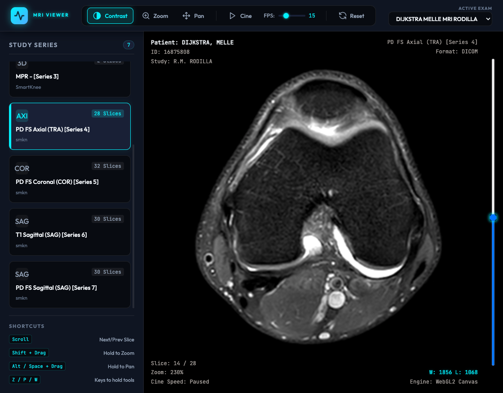

# MRI Scan Viewer

A high-performance static MRI scan viewer built with **Vite**, **Vanilla JavaScript**, and **CornerstoneJS**.



## Features

- **Multi-series Navigation**: Sidebar automatically lists all series (Axial, Coronal, Sagittal, etc.) inside a study with slice count badges.
- **PACS Keyboard & Mouse Controls**:
  - **Left Click + Drag**: Adjust Window Width (contrast) / Window Center (brightness) by default.
  - **Scroll Wheel**: Scroll forward/backward through slices.
  - **Shift + Drag (Gesture)**: Hold `Shift` while dragging to Zoom.
  - **Alt / Ctrl / Space + Drag (Gesture)**: Hold `Alt`, `Ctrl`, or `Spacebar` while dragging to Pan.
  - **Key Hold Hotkeys**: Hold `Z` (Zoom), `P` (Pan), or `W` / `C` (Contrast) to temporarily select that tool. Releasing returns to the previous tool.
- **Series Configuration State Persistence**: Automatically remembers and restores contrast (Window/Level), Zoom scale, and Pan translations separately for each series.
- **Slice Position Caching**: Automatically saves the active slice index for each series, restoring your exact slice coordinate when switching back and forth.
- **Interactive URL State Sharing**: Dynamically updates the browser URL parameters (e.g. `?exam=PATIENT_ID&series=SERIES_ID&slice=SLICENUM`) in real-time. Share the link to allow others to open the exact scan coordinates instantly.
- **Clinical-Grade Security**: Encrypts DICOM files to `.enc` locally using **AES-256-GCM** during compile, and decrypts them in-memory in the browser using the native **Web Crypto API**. The app remains locked behind a passcode prompt overlay.
- **Cine Auto-play Loop**: Play through slices automatically like a movie, with real-time FPS adjustable slider.
- **Overlay HUD**: PACS-workstation metadata layout displaying Patient info, Series info, Zoom levels, Slice numbers, and Window/Level values.

---

## Get Started

### 1. Install Dependencies
```bash
npm install
```

### 2. Run Local Development Server
```bash
npm run dev
```
Open [http://localhost:3000/](http://localhost:3000/) in your browser.

### 3. Build for Production
```bash
npm run build
```
This compiles a static version in the `dist/` directory, ready to be hosted on **GitHub Pages**, Netlify, or any static file server.

---

## Data Protection & Encryption

To protect personal healthcare details, raw files are kept locally and encrypted during compilation.

### How to set the decryption password:
Set your chosen password as an environment variable before building or running the dev server:
```bash
export SCAN_PASSWORD="your-strong-decryption-password"
npm run build
```
*(If you omit `SCAN_PASSWORD`, the script defaults to the developer passcode: `secure-scan-2026`)*.

---

## Adding More MRI Scans

This repo automatically encrypts and indexes any scans placed in the data folder:

1. Drop your new patient MRI directory into `raw_scans/`. For example:
   ```
   raw_scans/PATIENT_JOHN_DOE_MRI/
   ├── Series_1_Localizer/
   │   ├── Instance_0001.dcm
   │   └── ...
   └── Series_2_T2_SAG/
       ├── Instance_0001.dcm
       └── ...
   ```
2. The index list is automatically updated when you run `npm run dev` or `npm run build`.
3. To regenerate the index and encrypt files manually at any time, run:
   ```bash
   npm run encrypt-scans && npm run generate-index
   ```
4. Open the viewer, enter the passcode, and the dropdown in the header will list the new scan.

---

## Deploying to GitHub Pages

Since raw scans are kept locally and ignored in Git, the compilation happens locally on your computer where the raw files reside. Only the compiled code and **encrypted `.enc` files** inside `dist/` are pushed to GitHub.

1. Configure your repository origin (if not done):
   ```bash
   git init
   git remote add origin https://github.com/your-username/your-repo-name.git
   ```
2. Build with your secure production password:
   ```bash
   export SCAN_PASSWORD="your-secure-production-password"
   npm run build
   ```
3. Deploy the compiled assets:
   ```bash
   npm run deploy
   ```
4. In your GitHub repository **Settings** > **Pages**, set the deployment source branch to `gh-pages` and click **Save**.
